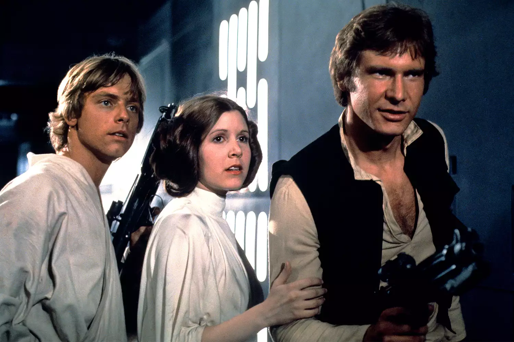

# Thomas Lowe
You had to ask me my favorite movie, didn't you? And I assume you only want one movie.
I have a literal ton of movies I love, but I'm going to go with Star Wars. And by Star Wars,
I mean A New Hope, Episode IV. If you haven't seen it, stop grading this right now, and go 
watch it. If you were one of a handful of people who haven't seen Star Wars, then you now
understand why I love this movie. It's wonderfully paced, with a beautiful world building, and
some of the best characters ever commited to film. I could literally talk about Star Wars all
day, and sometimes do with my wife, who also loves Star Wars.

***

|Actor|Reason|
|:-:|:--|
|Sebastian Stan| He looks like Luke already, and is used to action from Marvel |
|Kiera Knightly| She was one of Padme's handmaidens, and their own mothers couldn't tell them apart. Would be funny for her to play Leia |
|Nathan Fillion| Mal was basicly Han Solo anyways. |
| Andy Serkis | I could see redoing Chewie as a CGI character, but I find it to be a bit blasphomy. |